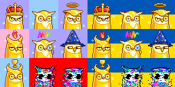

#  Moonbirds, Fast Food Moonbirds (Vol. I&II), Lil' Moonbirdies, & More - Pixel Owls Sandbox (& Download Cache)

Scripts, (token) metadata, images & more

## Collections - What's News?

24x24px Lil' Moonbirdies - 10 000 max.  
    [**lilmoonbirdies.png**](https://github.com/pixelartexchange/collections/blob/master/lilmoonbirdies/lilmoonbirdies-24x24.png) (~2.3MB)

42x42px Moonbirds - 10 000 max.  
     [**moonbirds.png**](https://github.com/pixelartexchange/collections/blob/master/moonbirds/moonbirds-42x42.png) (~4.6MB)

42x42px Fast Food Moonbirds (Vol. 1) - 5000 max.  
    [**fastfoodmoonbirds.png**](https://github.com/pixelartexchange/collections/blob/master/fastfoodmoonbirds/fastfoodmoonbirds-42x42.png) (~2.27MB)

42x42px Fast Food Moonbirds (Vol. 2) - 1000 max.  
  [**fastfoodmoonbirds-ii.png**](https://github.com/pixelartexchange/collections/blob/master/fastfoodmoonbirds-ii/fastfoodmoonbirds-ii-42x42.png) (~404k)

42x42px Fast Food Moonbirds (Vol. 3) - 4000 max.  

42x42px Starbirds - 3000 max.  
   [**starbirds.png**](https://github.com/pixelartexchange/collections/blob/master/starbirds/starbirds-42x42.png) (~2MB)

## Scripts - What's News?

### Moonbirds 1-Bit (Black & White And More) Editions

Example: Moonbird 1-bit variants

Source: [**moonbirds/generate_1bit »**](moonbirds/generate_1bit.rb)

### Fifteen Super Rare Never-Before-Seen Moonbirds - Vol. 1, 2, 3 & 4

Example: Vol. 1 - Jade Green Legendary Emperor Moonbirds

Example: Vol. 2  - Jade Green Legendary Sage Moonbirds

Example: Vol. 3 -  Enlightened Purple Legendary Crescent Fast Food Moonbirds

Example: Vol. 4 -  Enlightened Purple Legendary Crescent More Fast Food Moonbirds

Source: [**moonbirds/generate_fifteen »**](moonbirds/generate_fifteen.rb)

### Philip the Intern Presents: Phree the Phlock Variants - Left-Looking Moonb(h)irds V1, V2, V3

Example: Top selling golden moonbirds in phree the phlock variants

Source: [**moonbirds/phree_the_phlock »**](moonbirds/phree_the_phlock.rb)

### Glory To Ukraine! Stop the War! Fuck Vladimir Putin!

Public Service "Stop the War" Announcement:

The world has changed forever on February 24th, 2022
(and it's not the blockchain, it's war in Europe!).
Send a fuck (vladimir) putin! stop the war! glory to ukraine! message
to the world with your profile picture (such as your pixel owls, apes, etc.) with the flag of ukraine  in the background.

Example - First nine moonbirds

Example - Top selling golden moonbirds (plus red glitches)

Source: [**sandbox/glorytoukraine »**](sandbox/glorytoukraine.rb)

### Do-It-Yourself (DIY) - Yes, You Can - Generate Your Own Super-Rare Never-Before-Seen Moonbirds From Scratch

Example - Body Red

Example - Body Brown

Example - Body White

Example - Body Ruby Skeleton

Example - Skeleton

Source: [**moonbirds/generate_0x »**](moonbirds/generate_0x.rb)

## Questions? Comments?

Post them on the [CryptoPunksDev reddit](https://old.reddit.com/r/CryptoPunksDev). Thanks.

